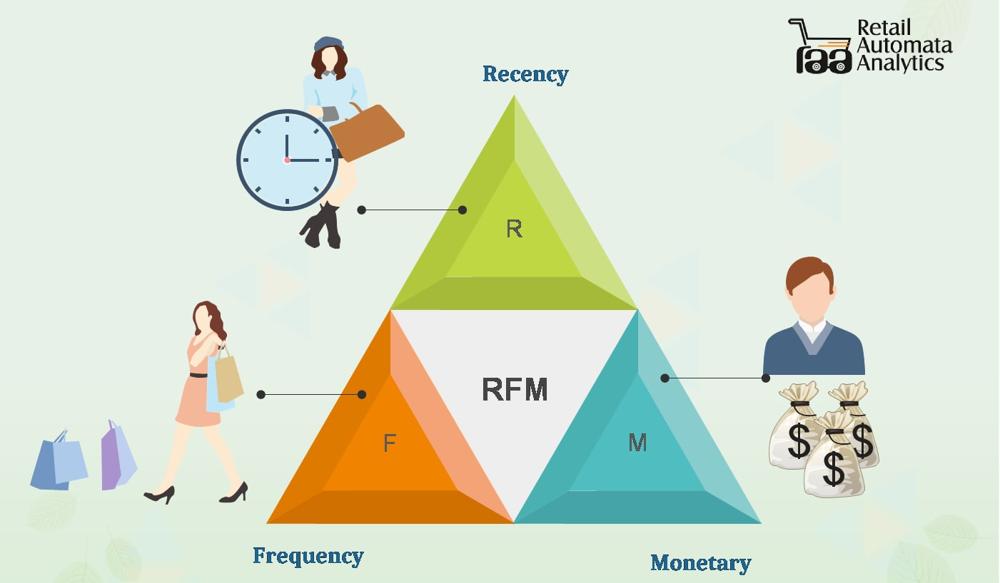

# Customer Segmentation/RMF Analysis

This project is a part of the Tasks issued to me by ParallelScore.

#### -- Project Status: 

## Project Intro/Objective
The objective of this study is to optimally cluster the customer data to get a clear view of various customers, develop customized marketing campaigns, choose specific product features for deployment and Prioritize new product development efforts.

## Data Description
After proper cleaning of our data to remove 543 null rows and 2 duplicate rows we arrived at a dataset of 10 features and 2452 records with 3 categorical and 7 numerical columns

## Environment, Tools and Libraries:
1.	Pandas for data manipulation 
2.	Numpy for mathematical calculation and analysis 
3.	Seaborn and Matplotlib for visualization and insights
4.	Sklearn for Machine Learning and preprocessing  
5.	Python 3.7 Environment 
6.	Jupyter and Microsoft Excel as tools  

### Methods Used
* Inferential Statistics
* Machine Learning
* Data Visualization
* Predictive Modeling
* etc.

## Needs of this project
- Business Analytics
- data exploration/descriptive statistics
- data processing/cleaning
- statistical modeling
- writeup/reporting
- etc. (be as specific as possible)

## Methodologies:
1.	Data Cleaning.
2.	Exploratory data analysis
3.	Clustering
4.	Improved clustering using RMF analysis
5.	Conclusion and visualization 

## Conclusion:
RFM and K-means clustering technique is a proven marketing model that helps e-commerce and fintech businesses maximize profit margins through better understanding of various customer segment.
After much data manipulation I arrived at this well-defined segment in the various users of our product below.

1.	Core/Loyal - Your Best Customers
Who They Are: Highly engaged customers who have bought the most recent, the most often, and generated the most revenue
2.	Slipping - Once Loyal, Now Gone
Who They Are: Great past customers who haven't bought in a while
3.	Faithful - The customers having common behaviour across these metrics.
Who They Are: Customer who have average metrics across each RFM scores
4.	Lost - The customers with low recency, frequency and monetary value

The above-generated RFM customer segments can be easily used to identify high ROI segments and engage them with personalized offers.

